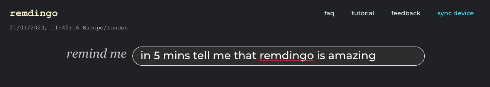
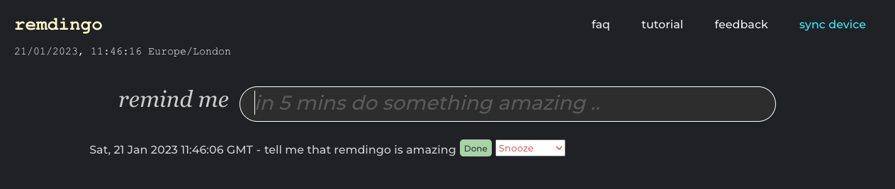

# REMDINGO

## Natural language reminders






# Command examples
```
list: display all upcoming reminders
history: display top fifty historical reminders
```

# Examples of reminders that can be used
```
Reminder examples
9am talk to friends
09:30 have a coffee
1800 eat a burger

in 30 mins go shopping
in 105 mins go shopping
in 45 minutes go shopping
in twenty minutes go shopping
in one hour go shopping
in 1 hour go shopping
in 1 hr go shopping
in 36 hours go shopping
in one hour and 30 mins go shopping
in 1 hour and thirty two minutes go shopping
in two hours and 45 minutes respond to email
in 2 hours and 45 mins respond to email
in 2 hours 45 mins respond to email
in 2 hrs 45 mins respond to email
in 1 day and 5 hours go shopping
in 2 weeks 22 hours and 35 minutes send email to person
in one month pay my rent

at 1630 take a break
at 5:30pm take a break
at 6am take a break
at 11 take a break
at 17:37 on 5th jan send email to person
at 17:37 on 5th oct 2022 send email to person
at 1630 on 5th september take a break
at 19:48 jan 5 send email to person
at 17:37 on 15/7 send email to person
at 12:34 on 1/2/2022

on 4th august at 2:45pm book holiday
on 1st jun at 2:45pm book holiday
on 28/12/2019 at 12:34 book holiday
on 28/12 12:34 book holiday

tomorrow at 1630 pick up delivery
tomorrow pick up delivery
tuesday at 12:34 book holiday
sunday 12:34 book holiday
sunday book holiday
next sunday 12:34 book holiday
next weds book holiday
```

# set up and run

### set up environment using pyenv env
```
pyenv install 3.11
virtualenv -p ~/.pyenv/versions/3.9.1/bin/python py
source py/bin/activate
pip install -r requirements.txt
```

### set up postgres in docker
```
./run.sh
```

### install remdingo schema and add users
```
cd remdingo/app
flask resetdb
```

### wait for a minute for postgres to start

### run app (will be running on http://localhost:5814/)
```
python -m remdingo.app.wsgi
```

### backup database
```
docker network create mynetwork
docker network connect mynetwork remdingo-postgres
docker run --rm --network mynetwork -e PGPASSWORD=remdingo5435434 -v $PWD/db_backups:/backups postgres:16.2 pg_dump -h remdingo-postgres -p 5432 -U postgres -Ft -f /backups/remdingo_db_$(date +%Y-%m-%d).tar remdingodb
```

# Docker

### run app locally in Docker (connects to external database)
```
docker build -t remdingo-app -f Dockerfile.app .
docker run -d -p 5814:5814 remdingo-app
```
App will be running at http://localhost:5814/

### rebuild and update local Docker container (after code changes)
```
docker stop remdingo-app
docker rm remdingo-app
docker build -t remdingo-app -f Dockerfile.app .
docker run -p 5814:5814 --name remdingo-app remdingo-app
```

### build and push to Docker Hub
```
./remdingo_push.sh --app
```

### deploy on server (run on the server)
```
./remdingo_update.sh
```

